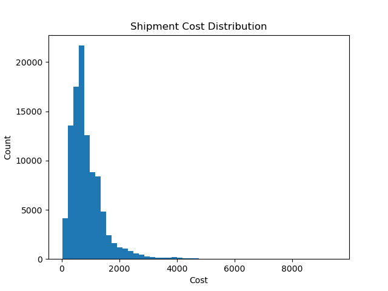
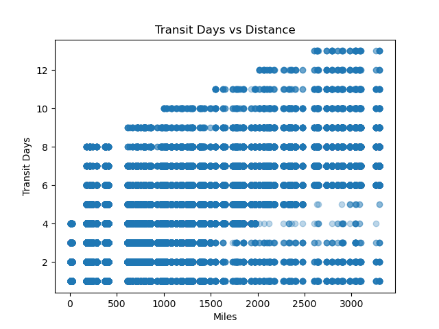

**Shipping Cost Dataset Simulation**

**Overview**

This project generates a synthetic freight shipment dataset designed to simulate realistic logistics network behavior. The dataset models warehouse-to-store shipping activity including carrier selection, transit times, pricing, and delivery outcomes.

The generator was built to create a realistic training dataset for machine learning and analytics projects involving shipping cost prediction and logistics analysis.

The final dataset contains ~100,000 simulated shipments across multiple warehouses, carriers, and destination stores.

**Dataset Features**

Each shipment record includes:

| Column            | Description                                      |
| ----------------- | ------------------------------------------------ |
| shipment_id       | Unique shipment identifier                       |
| carrier           | Carrier responsible for shipment                 |
| origin_warehouse  | Shipping warehouse                               |
| destination_store | Destination store                                |
| ship_date         | Date shipment departed                           |
| delivery_date     | Date shipment delivered                          |
| status            | Delivery status (Delivered / Missing / Returned) |
| weight            | Shipment weight (kg)                             |
| cost              | Final shipment cost                              |
| miles             | Distance between origin and destination          |
| transit_days      | Days required for delivery                       |

**Simulation Design**

The dataset is generated using a modular simulation engine.

**Lane Network**

- 150 warehouse-to-store shipping lanes
- Each lane associated with mileage distance
- All lanes guaranteed minimum shipment coverage

**Carrier Coverage**

- 7 simulated carriers
- Each carrier supports a subset of lanes
- Carrier usage distributed with realistic market share

**Shipment Generation**

Two phases of shipment creation:

1) Floor Coverage
   - Each lane-carrier pair repeated multiple times
   - Ensures every valid route appears in the dataset

3)  Random Volume
     - Additional shipments generated using weighted distance buckets
     - Distance ranges influence lane selection probability

**Pricing Model**

Shipment pricing is calculated using:

Cost =
((Miles × Carrier Mile Rate) + (Weight × Carrier Weight Rate))
× Service Multiplier
× Fuel Rate
× Random Price Variation

**Carrier-specific pricing tiers**

Rates vary by:
- mileage tier
- weight tier
- service level
- carrier fuel adjustment

**Random price variation**

Each shipment includes a small pricing noise factor:
±2% variation

**Transit Time Model**

Transit days are determined using:

- distance
- service level
- delivery status

Delivered shipments receive calculated transit days while missing or returned shipments leave transit fields blank.

Transit time increases smoothly with distance.

**Delivery Outcomes**

Shipment status is sampled using realistic probabilities:

| Status    | Approximate Rate |
| --------- | ---------------- |
| Delivered | ~96%             |
| Missing   | ~3%              |
| Returned  | ~1%              |

Non-delivered shipments do not receive delivery dates or transit days.

**Data Validation**

Quality checks ensure dataset integrity:

- No negative shipment costs
- No missing carrier assignments
- Transit days increase with mileage
- Expedited service only used for shorter routes
- Delivery dates occur after shipment dates
- Non-delivered shipments have blank delivery fields

Summary statistics are printed during generation.

**Example Dataset Statistics**

Example output from a generation run:

Total shipments: ~101,000

Cost Distribution
5%   ≈ $214
25%  ≈ $500
50%  ≈ $711
75%  ≈ $1097
95%  ≈ $1983

Transit Days
5%  → 1 day
25% → 2 days
50% → 3 days
75% → 5 days
95% → 8 days

**Example Visualizations**

These quick visualizations demonstrate the realism of the generated dataset.

Cost Distribution

Transit time vs Distance

Transit time increases with distance as expected in real logistics networks.

**Project Structure**

data_inputs/
- carrier_matrix.csv
- carrier_route_matrix.csv
- lane_id_route.csv
- pricing.csv

data_outputs/
- shipment_data.csv

sim/
- generate_dataset.py
- loaders.py
- pricing.py
- sampling.py
- transit.py
- validation.py
- export.py
- lane_model.py

**How to Run**

Generate the dataset:

  python sim/generate_dataset.py

The generated dataset will be saved to:

  data_outputs/logistics_shipment_dataset.csv

**Purpose**

This dataset generator was created to support projects involving:

- freight cost prediction
- logistics analytics
- machine learning model training
- transportation network analysis

The simulation approach allows realistic data generation without exposing proprietary logistics datasets.
